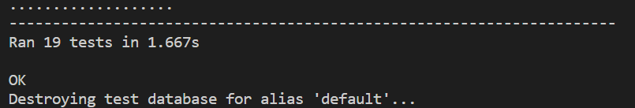
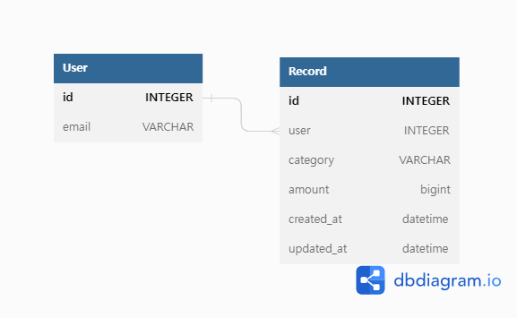

# 가계부 API

## 설치
- git clone 후 다음 명령어 실행
```
docker-compose up --build
```
- 테스트 결과 확인
```
docker-compose run --rm account_book sh -c 'python manage.py test'
```
- 테스트 내용
  - User API
    - 유저 생성
    - 유저 로그인 시 jwt 반환
    - 비밀번호 틀릴 시 jwt 반환하지 않음
    - 비밀번호가 짧은 경우 가입 실패
  - Record API
    - record 생성, 수정, 삭제
    - record 상세 내역 조회
    - record 상세 내역 복제
    - record 상세 내역 단축  url 생성
    - 단축 url로 request 시 리디렉션 여부 (302 FOUND)
  


## ERD
- DDL 파일은 ./src 경로 참조


## User
| 내용             | Method | URL                |
| ---------------- | ------ | ------------------ |
| 회원가입         | POST   | api/v1/user/create |
| jwt token 로그인 | GET    | api/v1/user/login  |

- email & password 로 회원가입
  - 비밀번호은 set_password 함수로 암호화하여 저장
- JWT 를 사용하여 인증
  - 로그인 시 토큰 발행


## 가계부 내역(Record)

| 내용      | Method    | URL                                  |
| --------- | --------- | ------------------------------------ |
| 조회      | GET       | api/v1/records                       |
| 상세      | GET       | api/v1/records/record_id             |
| 수정      | PUT,PATCH | api/v1/records/record_id             |
| 삭제      | DELETE    | api/v1/records/record_id             |
| 내역 복제 | POST      | api/v1/records/record_id/copy-detail |
| 내역 공유 | POST      | api/v1/records/record_id/share-url   |

- 조회
  - category: 카테고리(현금, 카드 등)
  - amount: 금액 
- 상세
  - category: 카테고리(현금, 카드 등)
  - amount: 금액 
  - memo: 메모
  - created_at: 생성 시간
  - updated_at: 업데이트 시간
- 내역 복제
  - 복제할 record 에서 id값을 변경하여 저장
- 내역 공유
  - {**base62**와 **random.sample** 함수를 이용하여 **생성된 문자열**}로 **임의의 url**을 생성
  - 공유할 **record의 url**을 **value**로, **임의의 url**을 **key**로 캐시에 10분간 저장 + 해당 url 과 **201**로 응답
  - 여러 번 생성 되는 것을 막기 위해 **record**{**pk**}를 **key**로, **단축 url**을 value로 캐시에 저장하여 다시 요청시 value 값과 **200**으로 응답
  -  **단축 url**을 클릭하면 캐시에서 해당 **단축 url**을 **key**로 가지는 **경로 value**로 **redirect**